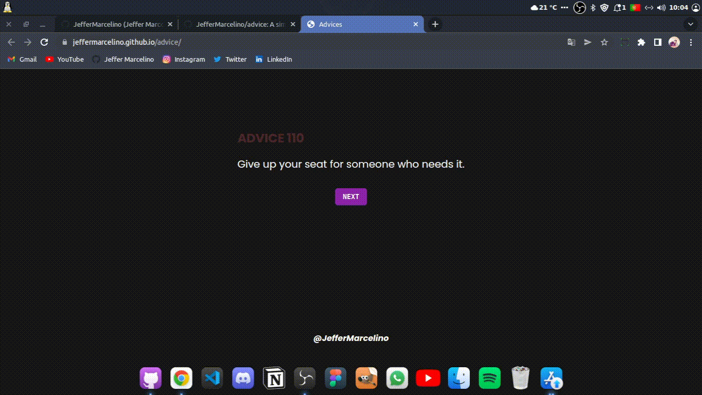

# Advice

# Preview

    

 

## 🚀 Technologies

This project was developed with the following technologies:
- HTML
- CSS
- JavaScript

### API's
- [Advice Slip JSON API](https://api.adviceslip.com/)

## 💻 Project

A simple website that returns a random advice.

 

You can acess it by clicking [here](https://jeffermarcelino.github.io/advice/)

 

## 📝 License

This project is under MIT license. See the [LICENSE](./LICENSE) file for more details.

---

Made by ♥ :wave: [Jeffer Marcelino!](https://github.com/JefferMarcelino/)
